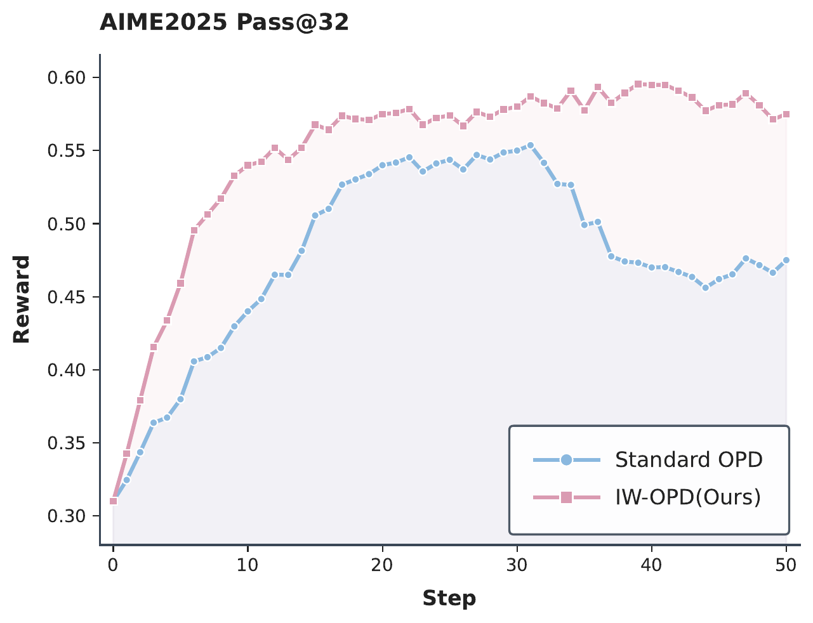
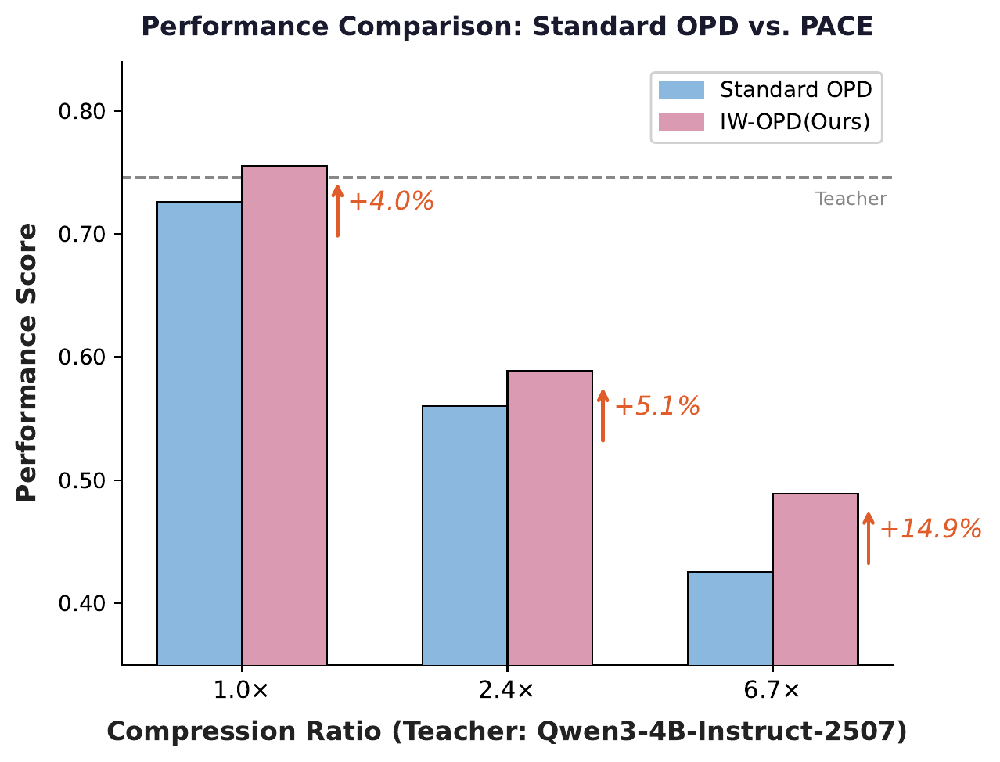

# IW-OPD

<table>
  <tr>
    <td width="50%" align="center" valign="top">
      
    </td>
    <td width="50%" align="center" valign="top">
      
    </td>
  </tr>
</table>

This repository contains the training and evaluation code for **IW-OPD**: an importance-weighted variant of on-policy distillation that reweights token-level OPD advantages by cumulative teacher--student disagreement along the sampled response. The implementation is based on `verl` PPO training with on-policy student rollouts, teacher log-probability evaluation on the same trajectories, and a stop-gradient IW-OPD weight applied directly to the PPO advantage.

## Installation

The training code is built on `verl` and uses vLLM for rollout generation.

```bash
conda create -n iw-opd python=3.10
conda activate iw-opd

cd IW-OPD/verl
USE_MEGATRON=0 bash scripts/install_vllm_sglang_mcore.sh
pip install math-verify
```

## Models and Data

The default training script expects the following local layout:

```text
IW-OPD/
|-- data/
|   |-- DeepMath-103K/train_filtered_level6.parquet
|   |-- AIME2024/test.parquet
|   `-- AIME2025/test.parquet
|-- models/
|   |-- Qwen3-4B/
|   `-- Qwen3-30B-A3B-Instruct-2507/
`-- verl/
```

Download the student and teacher models from Hugging Face:

- Student: [Qwen/Qwen3-4B](https://huggingface.co/Qwen/Qwen3-4B)
- Teacher: [Qwen/Qwen3-30B-A3B-Instruct-2507](https://huggingface.co/Qwen/Qwen3-30B-A3B-Instruct-2507)

For example:

```bash
huggingface-cli download Qwen/Qwen3-4B \
  --local-dir models/Qwen3-4B

huggingface-cli download Qwen/Qwen3-30B-A3B-Instruct-2507 \
  --local-dir models/Qwen3-30B-A3B-Instruct-2507
```

The math training and validation parquet files can be downloaded from the released OPD training data:

- Data: [Keven16/G-OPD-Training-Data](https://huggingface.co/datasets/Keven16/G-OPD-Training-Data)

Place the required files under `data/` as shown above. The main script uses `DeepMath-103K/train_filtered_level6.parquet` for training and evaluates on `AIME2024/test.parquet` and `AIME2025/test.parquet` during training.

## Training

The main IW-OPD example distills a Qwen3-4B student from a Qwen3-30B-A3B-Instruct-2507 teacher on 4 nodes with 8 GPUs per node.

```bash
cd IW-OPD/verl
bash examples/opd/run_qwen3-30b-a3b-instruct-opd_4b_iw_opd.sh
```

The script sets:

- `trainer.nnodes=4`
- `trainer.n_gpus_per_node=8`
- `actor_rollout_ref.model.path=../models/Qwen3-4B`
- `actor_rollout_ref.ref.model.path=../models/Qwen3-30B-A3B-Instruct-2507`
- `actor_rollout_ref.actor.policy_loss.iw_opd_weight_enable=true`
- `actor_rollout_ref.actor.policy_loss.iw_opd_weight_max=1.5`

You can override paths and the IW-OPD weight without editing the script:

```bash
DATA_ROOT=/path/to/data \
STUDENT_MODEL_PATH=/path/to/Qwen3-4B \
TEACHER_MODEL_PATH=/path/to/Qwen3-30B-A3B-Instruct-2507 \
OUTPUT_DIR=/path/to/checkpoints \
bash examples/opd/run_qwen3-30b-a3b-instruct-opd_4b_iw_opd.sh
```

To run the vanilla OPD baseline with the same student, teacher, data, and distributed settings, disable the IW-OPD weight:

```bash
IW_OPD_WEIGHT_ENABLE=false \
OUTPUT_DIR=/path/to/opd-checkpoints \
bash examples/opd/run_qwen3-30b-a3b-instruct-opd_4b_iw_opd.sh
```

For a multi-node run, start or submit the job from the Ray head node after all worker nodes are visible to Ray. The script itself only specifies the logical resource layout; cluster launch details depend on the scheduler used by your environment.

## Evaluation

Math evaluation scripts are in `math_eval/`.

```bash
cd IW-OPD/math_eval
bash run_eval_math.sh
```

Code evaluation uses EvalPlus-compatible scripts in `code_eval/scripts/`.

```bash
cd IW-OPD
CUDA_VISIBLE_DEVICES=0 bash code_eval/scripts/run_evalplus.sh humaneval <MODEL_PATH> 0 1.0 1.0 4
```

## Acknowledgments

This codebase is built on top of [G-OPD](https://github.com/RUCBM/G-OPD) and `verl`. We thank the G-OPD authors for releasing their implementation and training data.
